# 🔬 Rapport de TP — Instrumentation dynamique avec Frida sur Android

> **Module :** Sécurité mobile — Analyse dynamique  
> **Outil :** [Frida](https://frida.re/) v16.3.3  
> **Application cible :** DIVA (Damn Insecure and Vulnerable App) — `jakhar.aseem.diva`  
> **Plateforme :** Émulateur Android (x86_64) — `emulator-5554`  
> **Système hôte :** Windows 10/11 — PowerShell  
> **Date :** Avril 2026

---

## Table des matières

1. [Objectifs](#1-objectifs)
2. [Prérequis](#2-prérequis)
3. [Étape 1 — Installation du client Frida](#3-étape-1--installation-du-client-frida)
4. [Étape 2 — Installation des outils Android (ADB)](#4-étape-2--installation-des-outils-android-adb)
5. [Étape 3 — Récupération et déploiement de frida-server (Android)](#5-étape-3--récupération-et-déploiement-de-frida-server-android)
6. [Étape 4 — Test de connexion depuis le PC](#6-étape-4--test-de-connexion-depuis-le-pc)
7. [Étape 5 — Injection minimale pour valider l'environnement](#7-étape-5--injection-minimale-pour-valider-lenvironnement)
8. [Étape 6 — Exploration de la console interactive Frida pour l'analyse de sécurité](#8-étape-6--exploration-de-la-console-interactive-frida-pour-lanalyse-de-sécurité)
9. [Étape 7 — Observation des bibliothèques de chiffrement, du stockage local et des appels réseau sensibles](#9-étape-7--observation-des-bibliothèques-de-chiffrement-du-stockage-local-et-des-appels-réseau-sensibles)
10. [Étape 8 — Hooking de méthodes Java (SharedPreferences, SQLite, vérifications de sécurité)](#10-étape-8--hooking-de-méthodes-java-sharedpreferences-sqlite-vérifications-de-sécurité)
11. [Exercices pratiques (Livrables)](#11-exercices-pratiques-livrables)
12. [Dépannage](#12-dépannage)
13. [Annexe — Correspondance des captures d'écran](#13-annexe--correspondance-des-captures-décran)

---

## 1. Objectifs

Ce TP vise à :

- **Installer et vérifier** le client Frida (bibliothèque Python et outils CLI) sur un poste Windows.
- **Déployer et lancer** `frida-server` sur un émulateur Android.
- **Établir une connexion** et injecter un script minimal pour valider l'environnement d'instrumentation.
- **Explorer la console interactive Frida** pour l'inspection de processus orientée sécurité.
- **Observer les bibliothèques de chiffrement**, le stockage local et les appels réseau sensibles au niveau natif.
- **Hooker des méthodes Java** liées aux `SharedPreferences`, `SQLite` et aux vérifications de sécurité/débogage.
- **Diagnostiquer et corriger** les problèmes courants d'installation et de déploiement.

---

## 2. Prérequis

| Élément requis | Détails |
|---|---|
| **Système d'exploitation** | Windows 10/11 avec PowerShell |
| **Python** | 3.8+ (idéalement 3.10+/3.11), avec `pip` |
| **ADB** | Android Platform Tools ([téléchargement](https://developer.android.com/tools/releases/platform-tools)) |
| **Cible Android** | Émulateur ou appareil sous Android 8+ avec les Options développeur et le Débogage USB activés |
| **Application cible** | DIVA (`jakhar.aseem.diva`) installée sur l'émulateur |
| **Internet** | Nécessaire pour télécharger les binaires et les versions de Frida |

---

## 3. Étape 1 — Installation du client Frida

Le « client » désigne les outils exécutés sur le poste de l'analyste : `frida-tools` (CLI) et la bibliothèque Python `frida`.

### 3.1. Préparer Python et pip

Sous Windows, Python a été installé depuis [python.org](https://www.python.org/) avec l'option **« Add Python to PATH »** cochée.

Vérification :

```powershell
python --version
pip --version
```

### 3.2. Installer `frida` et `frida-tools`

Le client Frida et ses outils CLI sont installés via `pip` :

```powershell
pip install --upgrade frida frida-tools
```

Si plusieurs versions de Python coexistent, forcer l'interpréteur correct :

```powershell
python -m pip install --upgrade frida frida-tools
```

### 3.3. Vérifier l'installation

Trois commandes de vérification confirment l'installation :

```powershell
frida --version
frida-ps --version
python -c "import frida; print(frida.__version__)"
```

**Preuve — Capture 40 :** Les trois commandes retournent la version `16.3.3`, confirmant une installation du client Frida cohérente et fonctionnelle.

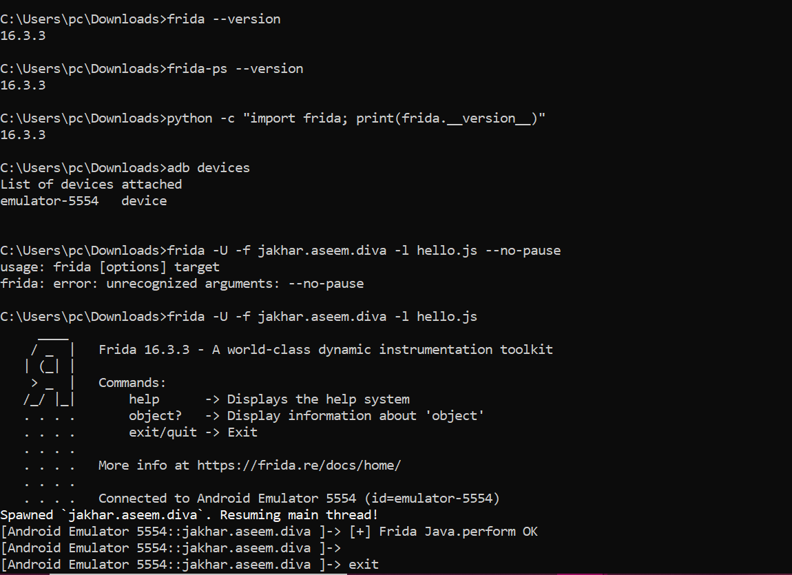

**Résultat attendu :** Un numéro de version cohérent (ex. `16.3.3`) retourné par les trois commandes.

---

## 4. Étape 2 — Installation des outils Android (ADB)

Les Android Platform Tools (ADB) ont été téléchargés depuis la [source officielle](https://developer.android.com/tools/releases/platform-tools) et le répertoire `platform-tools` a été ajouté au `PATH` du système.

### 4.1. Vérifier ADB et la connectivité de l'appareil

```powershell
adb devices
```

**Preuve — Capture 40 :** La commande `adb devices` affiche `emulator-5554  device`, confirmant une connexion correctement autorisée à l'émulateur Android.


> **Remarque :** Le statut de l'appareil doit afficher `device` (et non `unauthorized`). Si `unauthorized` apparaît, acceptez l'invite de clé RSA sur l'émulateur/appareil.

---

## 5. Étape 3 — Récupération et déploiement de frida-server (Android)

### 5.1. Identifier l'architecture CPU

Avant de télécharger `frida-server`, l'architecture CPU de l'appareil doit être identifiée pour sélectionner le bon binaire :

```powershell
adb shell getprop ro.product.cpu.abi
```

Dans notre environnement, l'émulateur Android fonctionne sur une architecture **x86_64**.

### 5.2. Télécharger le frida-server compatible

Le binaire `frida-server` correspondant a été téléchargé depuis la [page officielle des releases Frida](https://github.com/frida/frida/releases) :

```
frida-server-16.3.3-android-x86_64.xz
```

### 5.3. Extraire l'archive

Sous Windows, l'archive `.xz` a été extraite à l'aide de **7-Zip**. Après extraction, le binaire a été renommé en `frida-server`.

### 5.4. Pousser frida-server vers l'appareil Android

Le binaire est transféré vers un répertoire inscriptible sur l'appareil :

```powershell
adb push frida-server /data/local/tmp/
```

**Preuve — Capture 1 :** L'opération de transfert se termine avec succès : `1 file pushed, 0 skipped. 37.9 MB/s (113371768 bytes in 2.851s)`.

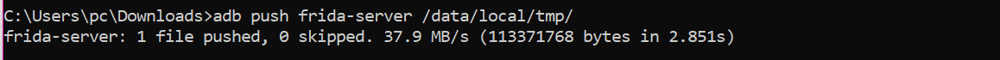

### 5.5. Rendre le binaire exécutable

Les permissions d'exécution sont accordées au binaire :

```powershell
adb shell chmod 755 /data/local/tmp/frida-server
```

### 5.6. Lancer frida-server

Le serveur peut être lancé en premier plan pour les tests initiaux, ou en arrière-plan pour une utilisation persistante.

**Lancement en premier plan (pour les tests) :**

```powershell
adb shell /data/local/tmp/frida-server -l 0.0.0.0
```

**Lancement en arrière-plan (pour une utilisation persistante) :**

```powershell
adb shell "nohup /data/local/tmp/frida-server -l 0.0.0.0 >/dev/null 2>&1 &"
```

### 5.7. Vérifier que frida-server est en cours d'exécution

Pour confirmer que le serveur est actif sur l'appareil :

```powershell
adb shell ps | grep frida
```

**Preuve — Capture 9 :** La sortie de `adb shell ps` montre un processus `frida-server` exécuté en tant que `root` (PID 2339), confirmant le déploiement réussi.

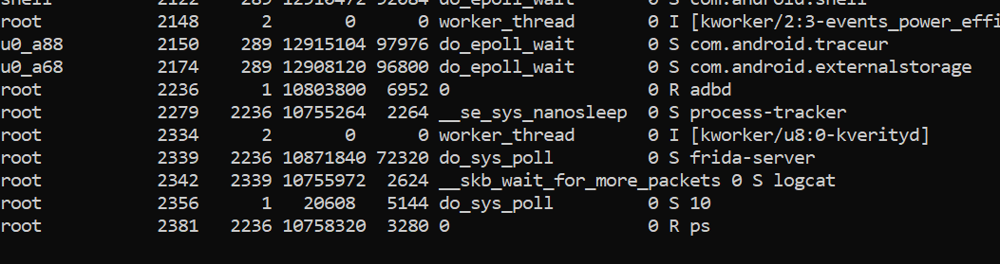

### 5.8. Configurer la redirection de ports ADB

La redirection de ports est mise en place pour permettre la communication entre le PC et `frida-server` :

```powershell
adb forward tcp:27042 tcp:27042
adb forward tcp:27043 tcp:27043
```

---

## 6. Étape 4 — Test de connexion depuis le PC

Avec l'appareil connecté et `frida-server` en cours d'exécution, la connexion est vérifiée en listant les processus depuis le PC.

### 6.1. Lister les processus en cours d'exécution

```powershell
frida-ps -U
```

Le drapeau `-U` indique à Frida de se connecter via USB (ou le transport de l'émulateur).

### 6.2. Lister les applications installées

```powershell
frida-ps -Uai
```

Le drapeau `-Uai` liste toutes les applications installées (y compris celles qui ne sont pas en cours d'exécution) avec leurs identifiants.

**Preuve — Capture 2 :** La commande `frida-ps -Uai` affiche une liste complète des applications sur l'émulateur, incluant l'application cible **Diva** (`jakhar.aseem.diva`), **SecureStorageLabJava** (`com.example.securestoragelabjava`), **Uncrackable Level 3** (`owasp.mstg.uncrackable3`), ainsi que d'autres applications système.

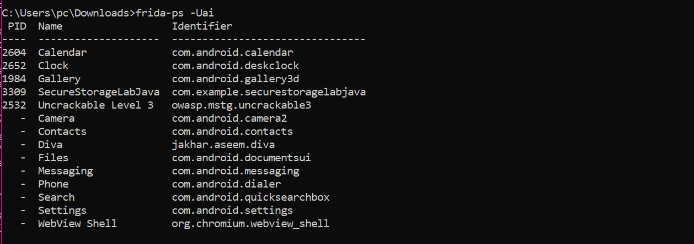

**Résultat attendu :** Un tableau de PID, noms et identifiants confirmant la connectivité complète de Frida.

---

## 7. Étape 5 — Injection minimale pour valider l'environnement

Une fois `frida-server` en cours d'exécution et `frida-ps -U` retournant des résultats, l'étape suivante est une injection minimale pour vérifier que Frida peut exécuter du code JavaScript au sein d'un processus cible.

### 7.1. Test de l'API Java — `hello.js`

Un script minimal a été créé pour tester le pont Java :

```javascript
Java.perform(function () {
  console.log("[+] Frida Java.perform OK");
});
```

Ce script appelle `Java.perform(...)` pour exécuter du code une fois la VM Java Android disponible.

**Commande d'injection :**

```powershell
frida -U -f jakhar.aseem.diva -l hello.js
```

> **Remarque :** Le drapeau `-f` lance une nouvelle instance de l'application cible. La tentative initiale avec `--no-pause` a produit une erreur `unrecognized arguments` (visible dans la Capture 40), résolue en supprimant le drapeau non supporté.

**Preuve — Capture 3 :** La console Frida affiche `Spawned 'jakhar.aseem.diva'. Resuming main thread!` suivi de `[+] Frida Java.perform OK`, confirmant l'instrumentation réussie de la couche Java.

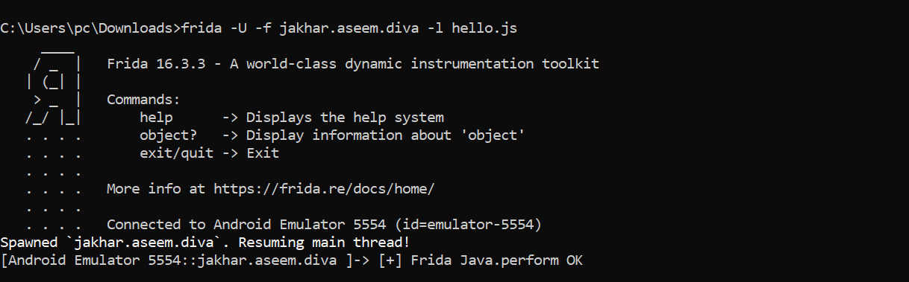

**Preuve — Capture 40 :** Montre à la fois l'erreur initiale `--no-pause` et l'exécution corrigée réussie, démontrant le processus de dépannage.


**Ce résultat confirme :**
- ✅ Frida est connecté à l'émulateur.
- ✅ Le processus cible est correctement instrumenté.
- ✅ L'API Java de Frida fonctionne au sein de l'application.

### 7.2. Test de hook natif — `hello_native.js`

Un second test cible une fonction native pour vérifier le hooking au niveau natif :

```javascript
console.log("[+] Script chargé");

Interceptor.attach(Module.getExportByName(null, "recv"), {
  onEnter(args) {
    console.log("[+] recv appelée");
  }
});
```

Ce script :
1. Affiche un message de confirmation au chargement.
2. Localise la fonction native `recv` (utilisée pour la réception de données réseau).
3. Attache un intercepteur pour journaliser chaque appel.

**Injection via spawn (`-f`) :**

```powershell
frida -U -f jakhar.aseem.diva -l hello_native.js
```

**Preuve — Capture 4 :** Montre l'injection du script en mode spawn. La console affiche `Spawning 'jakhar.aseem.diva'...`, `[+] Script chargé`, puis `Spawned 'jakhar.aseem.diva'. Resuming main thread!`, confirmant que le hook natif est chargé et actif.

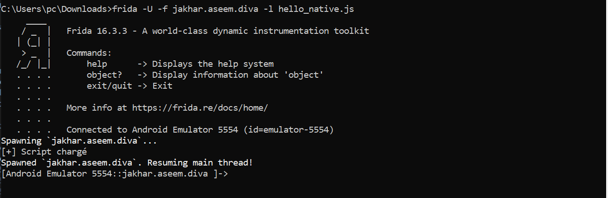

**Injection via attach (`-n`) :**

```powershell
frida -U -n "Diva" -l hello_native.js
```

**Preuve — Capture 5 :** Montre l'injection du script en mode attach. La console affiche `Attaching...`, `[+] Script chargé`, confirmant que Frida peut également s'attacher à un processus déjà en cours d'exécution pour le hooking natif.

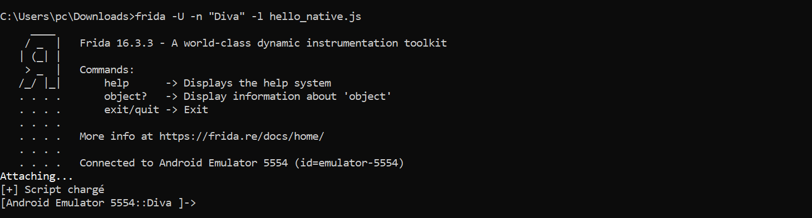

### 7.3. Notes importantes

- Le test `hello.js` valide l'instrumentation Java.
- Le test `hello_native.js` valide le hooking au niveau natif.
- Le message `[+] recv appelée` n'apparaît que si l'application effectue une opération réseau utilisant cette fonction.
- Si l'application n'est pas encore en cours d'exécution, préférer `-f` (spawn) à `-n` (attach).

---

## 8. Étape 6 — Exploration de la console interactive Frida pour l'analyse de sécurité

Après l'injection d'un script, la console interactive Frida s'ouvre automatiquement. Cette console permet d'exécuter des commandes JavaScript directement au sein du processus cible pour observer son comportement, identifier les composants natifs et collecter des informations pertinentes pour la sécurité.

### 8.1. Lancement de la session interactive

```powershell
frida -U -n "Diva" -l hello_native.js
```

Une fois attaché, la console affiche :

```
[Android Emulator 5554::Diva ]->
```

### 8.2. Vérifier l'architecture du processus

```javascript
Process.arch
```

**Preuve — Capture 6 :** Retourne `"x64"`, confirmant que l'émulateur exécute un processus x86_64.

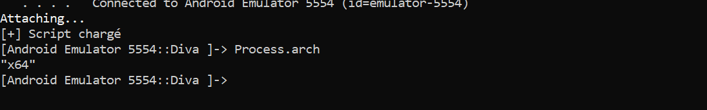

### 8.3. Identifier le module principal

```javascript
Process.mainModule
```

**Preuve — Capture 10 :** Retourne les détails du module principal :
```json
{
    "base": "0x63e68fe0d000",
    "name": "app_process64",
    "path": "/system/bin/app_process64",
    "size": 45056
}
```

Ceci identifie le point d'entrée natif du processus — `app_process64` est le lanceur de processus standard d'Android.

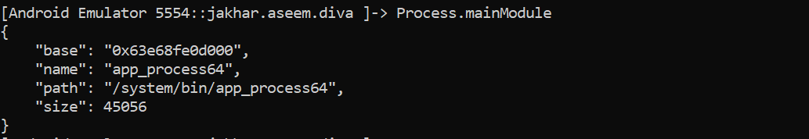

### 8.4. Inspecter une bibliothèque système critique

```javascript
Process.getModuleByName("libc.so")
```

**Preuve — Capture 7 :** Retourne les détails complets de `libc.so` :
```json
{
    "base": "0x70e7dcc89000",
    "name": "libc.so",
    "path": "/apex/com.android.runtime/lib64/bionic/libc.so",
    "size": 946176
}
```

En analyse de sécurité, `libc.so` est critique car elle contient les fonctions natives pour les E/S fichiers, le réseau, la mémoire et la gestion des processus.

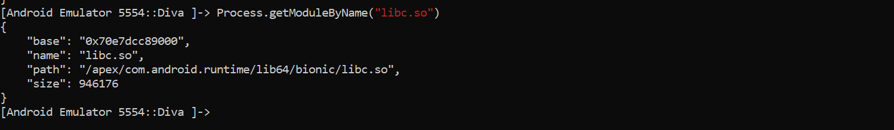

### 8.5. Vérifier la présence d'une fonction sensible

```javascript
Process.getModuleByName("libc.so").getExportByName("recv")
```

**Preuve — Capture 8 :** Retourne `"0x70e7dccf3d30"`, l'adresse mémoire de la fonction `recv`. Ceci confirme que la fonction peut être interceptée pour l'analyse du trafic réseau.

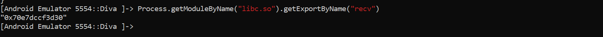

### 8.6. Lister les bibliothèques chargées

```javascript
Process.enumerateModules()
```

**Preuve — Captures 11–14 :** Montrent la sortie de `Process.enumerateModules()`, listant toutes les bibliothèques partagées chargées dans le processus. Observations clés :

- **Capture 11 :** Montre le début de la liste des modules avec les adresses de base et les chemins.
- **Capture 12 :** Continue la liste des modules montrant diverses bibliothèques système.
- **Capture 13 :** Montre `libssl.so` et `libcrypto.so` parmi les modules chargés — indiquant que l'application a accès aux primitives TLS/SSL et cryptographiques.
- **Capture 14 :** Conclut la liste des modules.

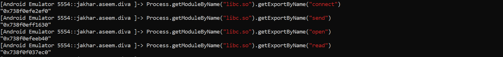
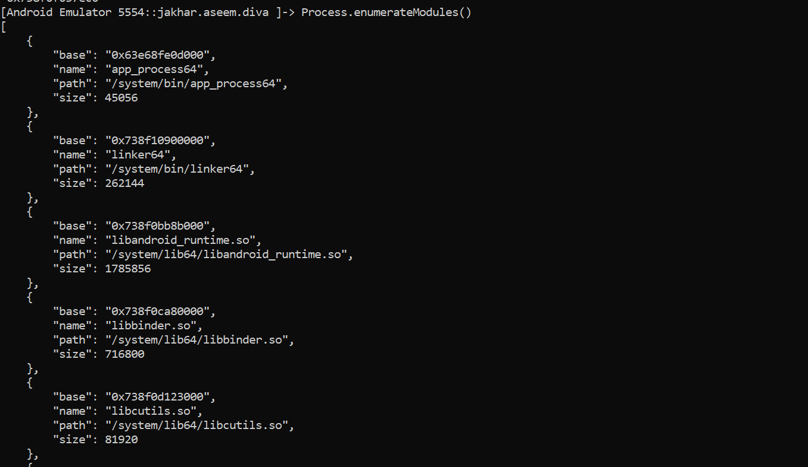
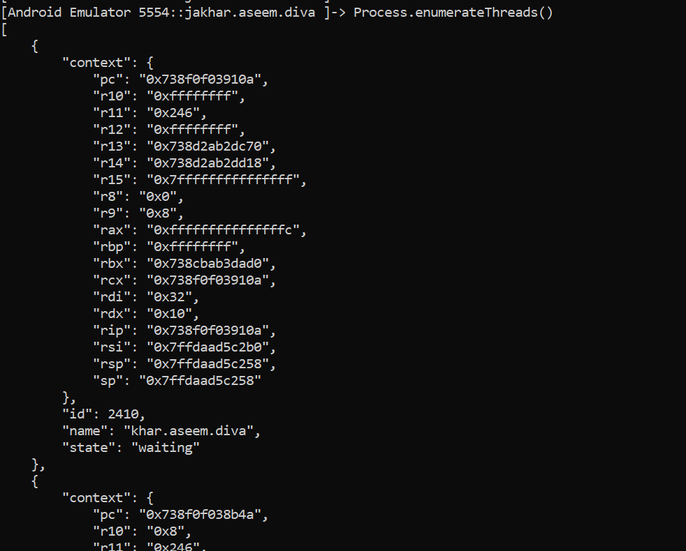
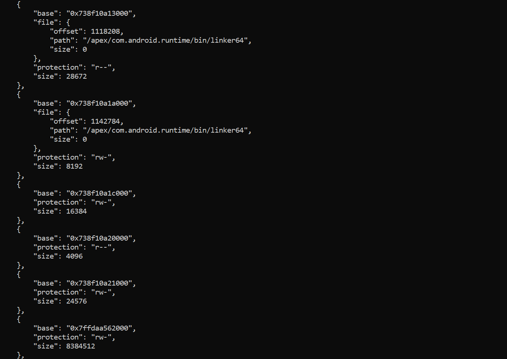

### 8.7. Lister les threads actifs

```javascript
Process.enumerateThreads()
```

**Preuve — Captures 15–17 :** Affichent les threads actifs du processus, montrant leurs identifiants et états. Cela permet de comprendre le modèle de concurrence de l'application et d'identifier les threads dédiés au réseau, au chiffrement ou au traitement natif.

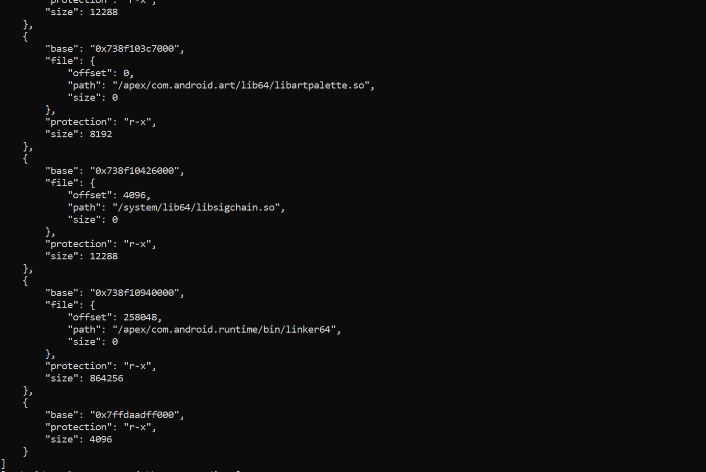
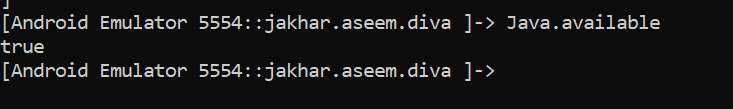
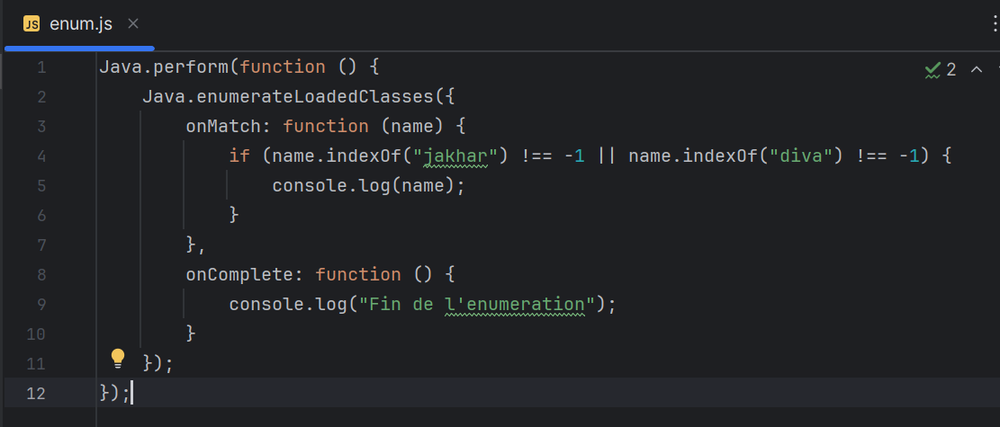

### 8.8. Examiner les plages mémoire

```javascript
Process.enumerateRanges('r-x')
```

**Preuve — Captures 18–19 :** Listent les régions mémoire avec les permissions lecture-exécution. Ces régions contiennent le code exécutable, y compris le code natif de l'application et les segments des bibliothèques chargées.

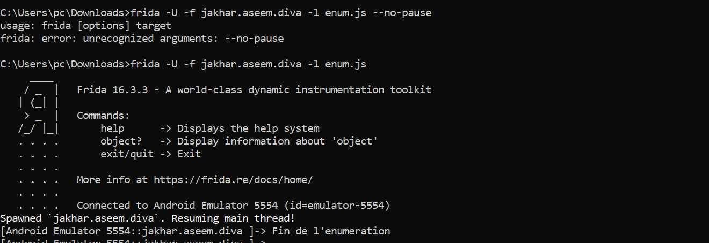
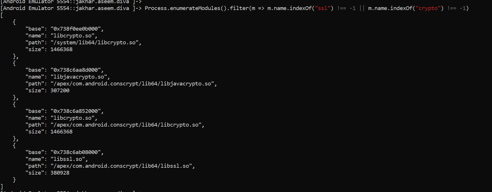

### 8.9. Vérifier la disponibilité de l'environnement Java

```javascript
Java.available
```

**Preuve — Capture 20 :** Retourne `true`, confirmant que l'environnement d'exécution Java est accessible. Cela permet l'énumération des classes Java et le hooking de méthodes.

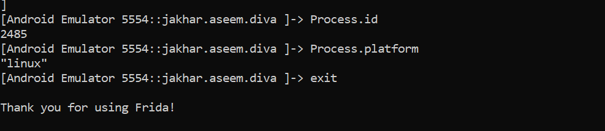

### 8.10. Énumérer les classes Java liées à l'application

```javascript
Java.perform(function () {
  Java.enumerateLoadedClasses({
    onMatch: function (name) {
      if (name.indexOf("Diva") !== -1) {
        console.log(name);
      }
    },
    onComplete: function () {
      console.log("Fin de l'énumération");
    }
  });
});
```

**Preuve — Capture 21 :** Affiche les classes Java chargées dont le nom contient « Diva », révélant la structure interne des classes de l'application — essentiel pour identifier les cibles du hooking au niveau Java.


### 8.11. Filtrer les bibliothèques de chiffrement/TLS

```javascript
Process.enumerateModules().filter(m =>
  m.name.indexOf("ssl") !== -1 || m.name.indexOf("crypto") !== -1
)
```

**Preuve — Capture 22 :** Le filtre retourne des modules tels que `libssl.so` et `libcrypto.so`, confirmant la présence de bibliothèques natives TLS/cryptographiques.

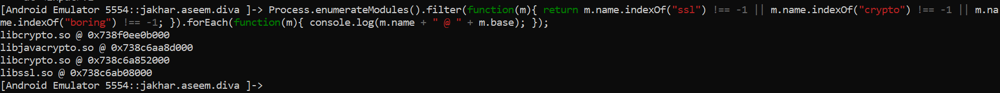

### 8.12. Identification du processus

```javascript
Process.id
Process.platform
Process.arch
```

**Preuve — Capture 32 :** Retourne :
- `Process.id` → `2530`
- `Process.platform` → `"linux"`
- `Process.arch` → `"x64"`

Ces valeurs documentent le contexte précis de l'analyse pour la reproductibilité.

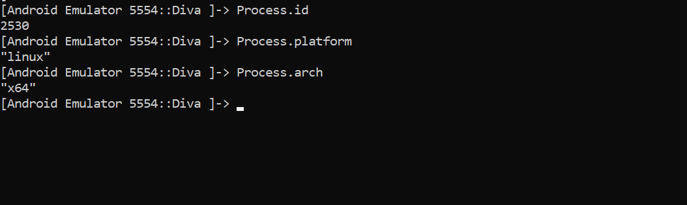

### 8.13. Quitter la session

```javascript
exit
```

La commande `exit` (ou `quit`) termine proprement la session Frida.

---

## 9. Étape 7 — Observation des bibliothèques de chiffrement, du stockage local et des appels réseau sensibles

Cette étape étend l'analyse pour observer comment l'application interagit avec les bibliothèques cryptographiques, le stockage local et les fonctions réseau au niveau natif.

### 9.1. Localiser les bibliothèques de chiffrement

```javascript
Process.enumerateModules().filter(m =>
  m.name.indexOf("ssl") !== -1 ||
  m.name.indexOf("crypto") !== -1 ||
  m.name.indexOf("boring") !== -1
)
```

**Preuve — Capture 22 :** Confirme la présence de `libssl.so` et `libcrypto.so` dans les modules chargés. Ces bibliothèques gèrent les connexions TLS et les opérations cryptographiques.


### 9.2. Vérifier les fonctions réseau sensibles

```javascript
Process.getModuleByName("libc.so").getExportByName("connect")
```

**Preuve — Capture 23 :** Retourne l'adresse mémoire de la fonction `connect`, confirmant qu'elle peut être interceptée.

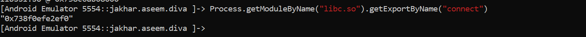

### 9.3. Hooker `connect` — `hook_connect.js`

```javascript
console.log("[+] Hook connect chargé");

const connectPtr = Process.getModuleByName("libc.so").getExportByName("connect");
console.log("[+] connect trouvée à : " + connectPtr);

Interceptor.attach(connectPtr, {
  onEnter(args) {
    console.log("[+] connect appelée");
    console.log("    fd = " + args[0]);
    console.log("    sockaddr = " + args[1]);
  },
  onLeave(retval) {
    console.log("    retour = " + retval.toInt32());
  }
});
```

**Injection :**

```powershell
frida -U -n "Diva" -l hook_connect.js
```

**Preuve — Capture 24 :** Montre le chargement réussi du hook avec `[+] Hook connect chargé` et `[+] connect trouvée à :` suivi de l'adresse de la fonction.

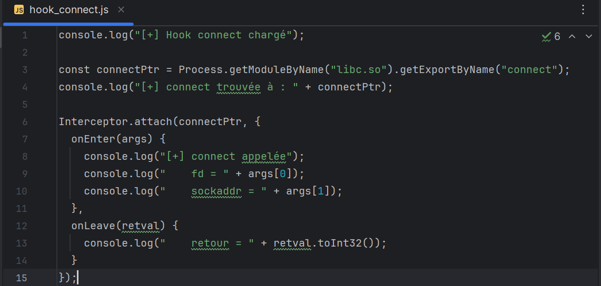

### 9.4. Hooker `send` et `recv` — `hook_network.js`

```javascript
console.log("[+] Hooks réseau chargés");

const sendPtr = Process.getModuleByName("libc.so").getExportByName("send");
const recvPtr = Process.getModuleByName("libc.so").getExportByName("recv");

console.log("[+] send trouvée à : " + sendPtr);
console.log("[+] recv trouvée à : " + recvPtr);

Interceptor.attach(sendPtr, {
  onEnter(args) {
    console.log("[+] send appelée");
    console.log("    fd = " + args[0]);
    console.log("    len = " + args[2].toInt32());
  }
});

Interceptor.attach(recvPtr, {
  onEnter(args) {
    console.log("[+] recv appelée");
    console.log("    fd = " + args[0]);
    console.log("    len demandé = " + args[2].toInt32());
  },
  onLeave(retval) {
    console.log("    recv retourne = " + retval.toInt32());
  }
});
```

**Injection :**

```powershell
frida -U -n "Diva" -l hook_network.js
```

**Preuve — Capture 26 :** Montre le code source complet de `hook_network.js` dans l'éditeur, avec les appels `Interceptor.attach` sur `sendPtr` et `recvPtr`.

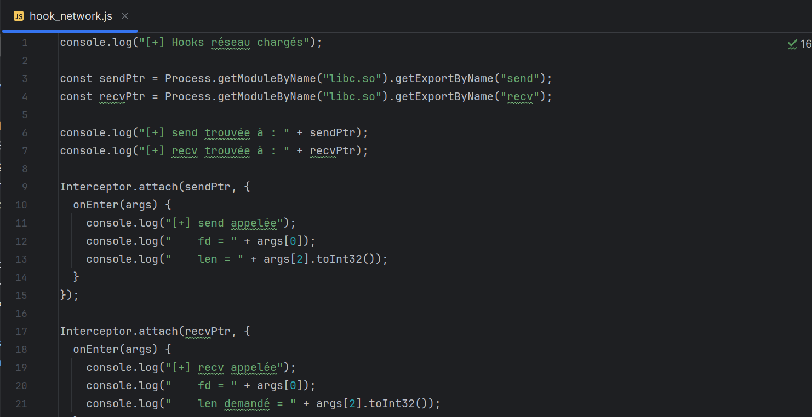

**Preuve — Capture 25 :** Montre les hooks réseau chargés : `[+] Hooks réseau chargés`, confirmant que `send` et `recv` sont tous deux interceptés avec leurs adresses respectives affichées.

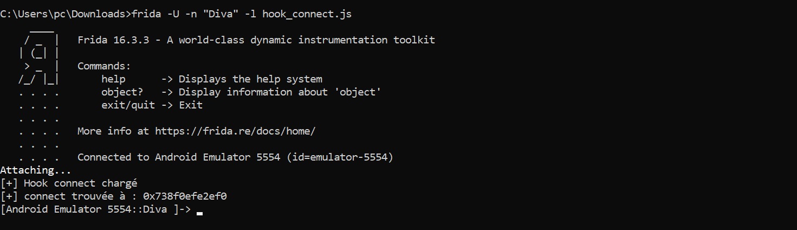

### 9.5. Hooker l'accès au système de fichiers — `hook_file.js`

```javascript
console.log("[+] Hook fichiers chargé");

const openPtr = Process.getModuleByName("libc.so").getExportByName("open");
const readPtr = Process.getModuleByName("libc.so").getExportByName("read");

console.log("[+] open trouvée à : " + openPtr);
console.log("[+] read trouvée à : " + readPtr);

Interceptor.attach(openPtr, {
  onEnter(args) {
    this.path = args[0].readUtf8String();
    console.log("[+] open appelée : " + this.path);
  }
});

Interceptor.attach(readPtr, {
  onEnter(args) {
    console.log("[+] read appelée");
    console.log("    fd = " + args[0]);
    console.log("    taille = " + args[2].toInt32());
  }
});
```

**Injection :**

```powershell
frida -U -n "Diva" -l hook_file.js
```

**Preuve — Capture 28 :** Montre le code source complet de `hook_file.js` dans l'éditeur, avec les appels `Interceptor.attach` sur `openPtr` et `readPtr`.

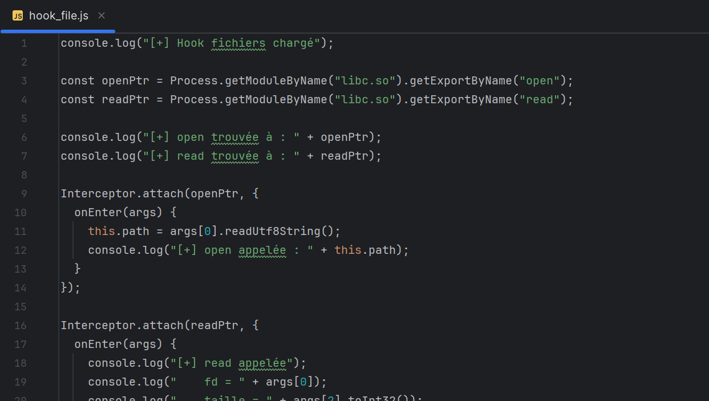

**Preuve — Capture 29 :** La sortie de l'injection affiche `[+] Hook fichiers chargé`, avec les adresses de `open` (`0x738f0efeeb40`) et `read` (`0x738f0f037ec0`) affichées, confirmant que les hooks sont actifs.

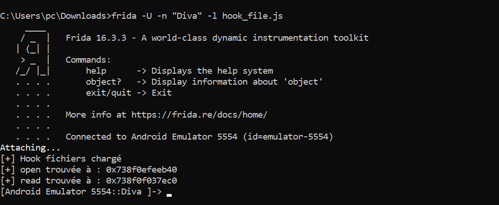

### 9.6. Vérifier la disponibilité de l'environnement Java

```javascript
Java.available
```

Retourne `true`, permettant la transition vers l'analyse au niveau Java (confirmé à l'Étape 6.9, Capture 20).

### 9.7. Rechercher les classes Java liées à la sécurité

```javascript
Java.perform(function () {
  Java.enumerateLoadedClasses({
    onMatch: function (name) {
      var n = name.toLowerCase();
      if (
        n.indexOf("security") !== -1 ||
        n.indexOf("crypto") !== -1 ||
        n.indexOf("prefs") !== -1 ||
        n.indexOf("sqlite") !== -1 ||
        n.indexOf("storage") !== -1
      ) {
        console.log(name);
      }
    },
    onComplete: function () {
      console.log("Fin de l'énumération");
    }
  });
});
```

**Preuve — Capture 27 :** Liste les classes Java liées à la sécurité, la cryptographie, les préférences et SQLite. Les classes clés découvertes incluent `javax.crypto.*`, `android.security.*` et `android.database.sqlite.*` — ce sont des cibles de haute valeur pour le hooking au niveau Java.

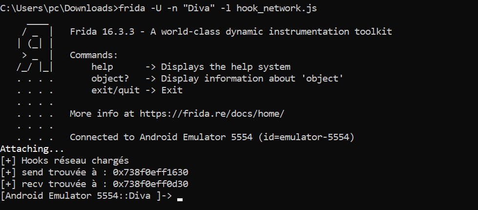

### 9.8. Examiner les plages mémoire exécutables

```javascript
Process.enumerateRanges('r-x')
```

**Preuve — Captures 30–31 :** Affichent les régions mémoire marquées comme lisibles et exécutables, montrant la disposition des segments de code natif incluant `libc.so`, `libsigchain.so` et `linker64`.

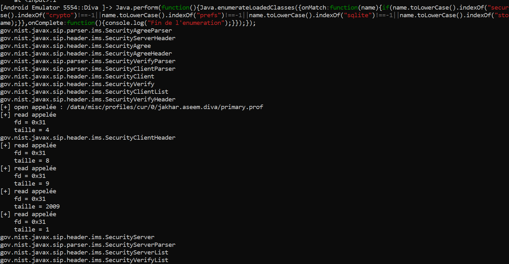
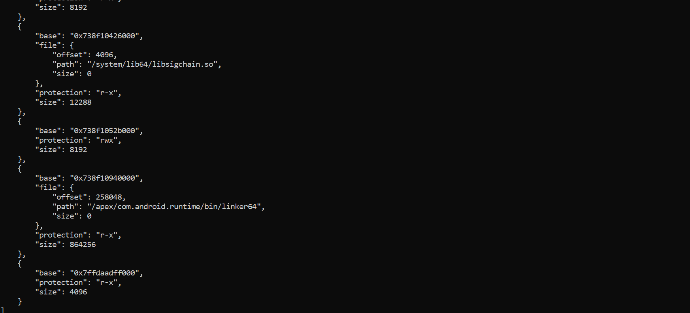

### 9.9. Documenter le contexte du processus

```javascript
Process.id
Process.platform
Process.arch
```

**Preuve — Capture 32 :** Confirme l'identifiant du processus `2530`, la plateforme `"linux"`, l'architecture `"x64"`.


---

## 10. Étape 8 — Hooking de méthodes Java (SharedPreferences, SQLite, vérifications de sécurité)

Après avoir observé les appels au niveau natif, cette étape étend l'analyse à la couche Java. De nombreuses applications Android gèrent des éléments sensibles (préférences locales, bases de données SQLite, vérifications de sécurité) via les API Java.

### 10.1. Vérifier l'accessibilité de l'environnement Java

```javascript
Java.available
```

Retourne `true` (confirmé à l'Étape 6.9). Cela permet l'utilisation de `Java.perform(...)` pour hooker les classes et méthodes Java.

### 10.2. Observer les lectures SharedPreferences — `hook_prefs.js`

Les SharedPreferences sont couramment utilisées pour stocker des données de configuration, des jetons de session et des indicateurs internes.

**Script — `hook_prefs.js` :**

```javascript
Java.perform(function () {
  console.log("[+] Hook SharedPreferences chargé");

  var Impl = Java.use("android.app.SharedPreferencesImpl");

  Impl.getString.overload("java.lang.String", "java.lang.String").implementation = function (key, defValue) {
    var result = this.getString(key, defValue);
    console.log("[SharedPreferences][getString] key=" + key + " => " + result);
    return result;
  };

  Impl.getBoolean.overload("java.lang.String", "boolean").implementation = function (key, defValue) {
    var result = this.getBoolean(key, defValue);
    console.log("[SharedPreferences][getBoolean] key=" + key + " => " + result);
    return result;
  };
});
```

**Preuve — Capture 33 :** Montre le script complet `hook_prefs.js` dans l'éditeur, conforme aux instructions du TP.

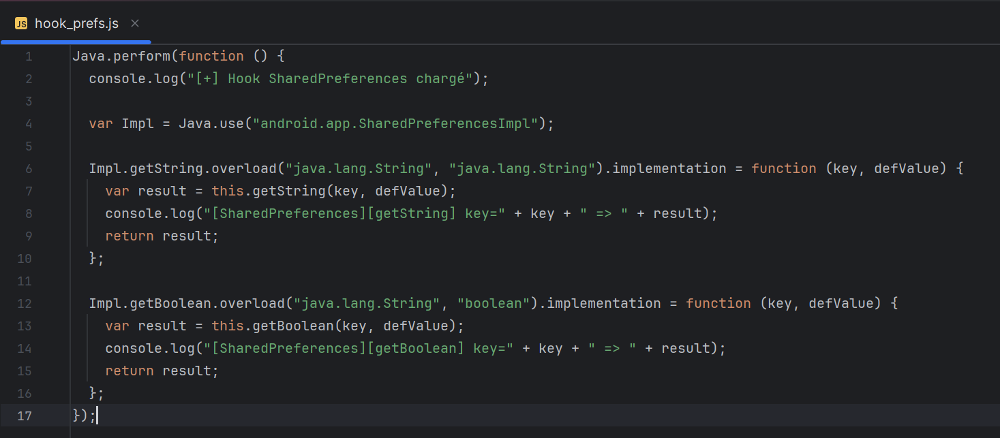

**Injection :**

```powershell
frida -U -n "Diva" -l hook_prefs.js
```

**Preuve — Capture 34 :** La console affiche `[+] Hook SharedPreferences chargé`, confirmant que les hooks sur `getString` et `getBoolean` sont actifs.

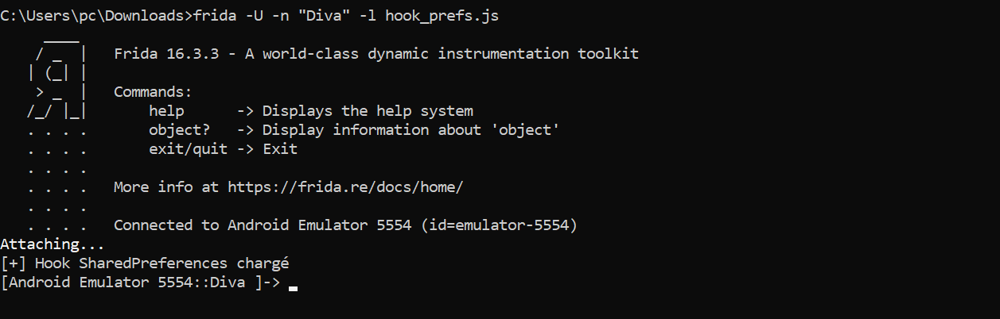

### 10.3. Observer les écritures SharedPreferences — `hook_prefs_write.js`

**Script — `hook_prefs_write.js` :**

```javascript
Java.perform(function () {
  console.log("[+] Hook écriture SharedPreferences chargé");

  var EditorImpl = Java.use("android.app.SharedPreferencesImpl$EditorImpl");

  EditorImpl.putString.overload("java.lang.String", "java.lang.String").implementation = function (key, value) {
    console.log("[SharedPreferences][putString] key=" + key + " value=" + value);
    return this.putString(key, value);
  };

  EditorImpl.putBoolean.overload("java.lang.String", "boolean").implementation = function (key, value) {
    console.log("[SharedPreferences][putBoolean] key=" + key + " value=" + value);
    return this.putBoolean(key, value);
  };
});
```

**Preuve — Capture 35 :** Montre le script complet `hook_prefs_write.js` dans l'éditeur.

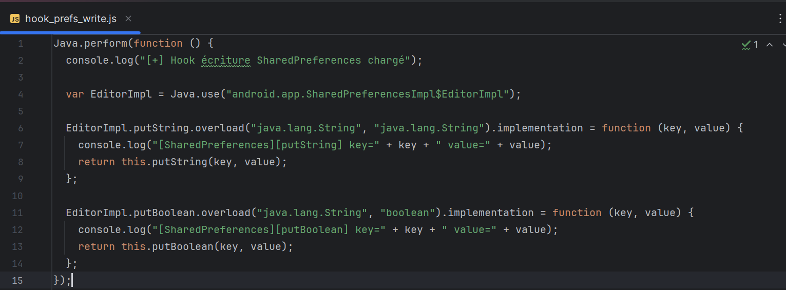

**Injection :**

```powershell
frida -U -n "Diva" -l hook_prefs_write.js
```

**Preuve — Capture 36 :** La console affiche `[+] Hook écriture SharedPreferences chargé`, confirmant que les hooks d'écriture sur `putString` et `putBoolean` sont opérationnels.

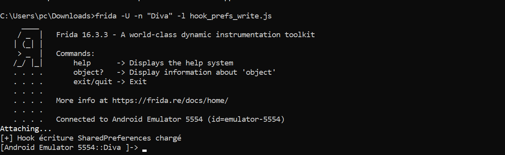

### 10.4. Observer les requêtes SQLite — `hook_sqlite.js`

Les bases de données SQLite sont couramment utilisées pour le stockage structuré de données locales.

**Script — `hook_sqlite.js` :**

```javascript
Java.perform(function () {
  console.log("[+] Hook SQLite chargé");

  var SQLiteDatabase = Java.use("android.database.sqlite.SQLiteDatabase");

  SQLiteDatabase.execSQL.overload("java.lang.String").implementation = function (sql) {
    console.log("[SQLite][execSQL] " + sql);
    return this.execSQL(sql);
  };

  SQLiteDatabase.rawQuery.overload("java.lang.String", "[Ljava.lang.String;").implementation = function (sql, args) {
    console.log("[SQLite][rawQuery] " + sql);
    return this.rawQuery(sql, args);
  };
});
```

**Preuve — Capture 37 :** Montre le script complet `hook_sqlite.js` dans l'éditeur.

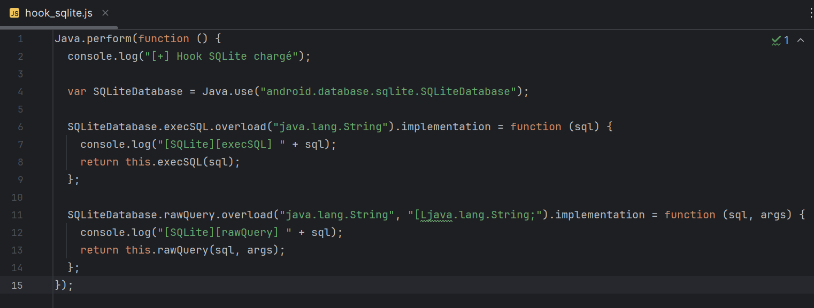

**Injection :**

```powershell
frida -U -n "Diva" -l hook_sqlite.js
```

**Preuve — Capture 38 :** La console affiche `[+] Hook SQLite chargé`, confirmant que les appels `execSQL` et `rawQuery` sont désormais interceptés.

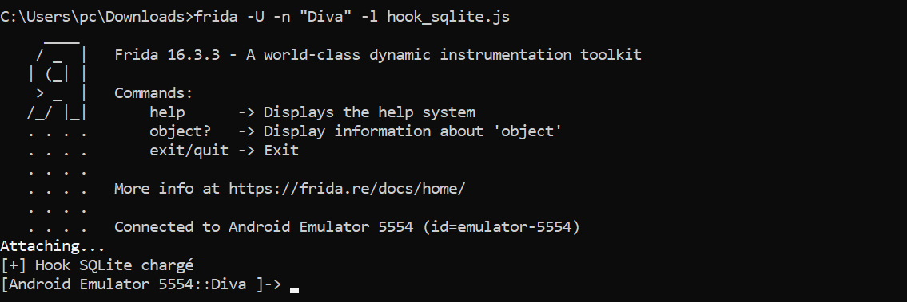

### 10.5. Rechercher les classes Java liées à la sécurité/débogage

Avant d'installer des hooks supplémentaires, les classes Java chargées liées à la sécurité, au débogage et au stockage ont été énumérées :

```javascript
Java.perform(function () {
  Java.enumerateLoadedClasses({
    onMatch: function (name) {
      var n = name.toLowerCase();
      if (
        n.indexOf("debug") !== -1 ||
        n.indexOf("root") !== -1 ||
        n.indexOf("security") !== -1 ||
        n.indexOf("crypto") !== -1 ||
        n.indexOf("sqlite") !== -1 ||
        n.indexOf("prefs") !== -1
      ) {
        console.log(name);
      }
    },
    onComplete: function () {
      console.log("Fin de l'énumération");
    }
  });
});
```

**Preuve — Capture 39 :** Montre les résultats de l'énumération filtrés par `debug`, `root`, `security`, `crypto`, `sqlite` et `prefs`. Des classes telles que `gov.nist.javax.sip.header.ims.SecurityAgreeHeader`, `gov.nist.core.Debug` et divers parseurs liés à la sécurité sont listés, cartographiant la surface des classes liées à la sécurité de l'application.

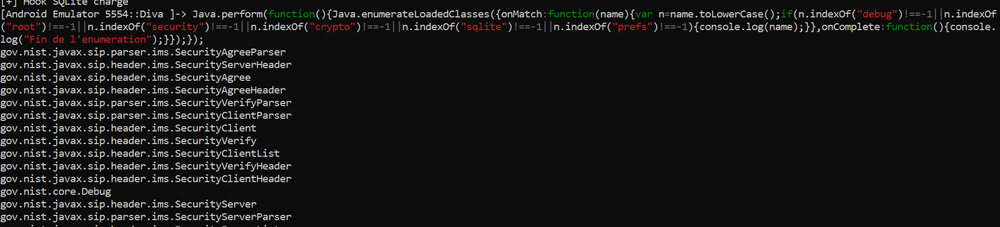

### 10.6. Observer les vérifications de débogage — `hook_debug.js`

Certaines applications vérifient la présence d'un débogueur connecté comme mesure de sécurité :

```javascript
Java.perform(function () {
  console.log("[+] Hook Debug chargé");

  var Debug = Java.use("android.os.Debug");

  Debug.isDebuggerConnected.implementation = function () {
    var result = this.isDebuggerConnected();
    console.log("[Debug] isDebuggerConnected() => " + result);
    return result;
  };

  Debug.waitingForDebugger.implementation = function () {
    var result = this.waitingForDebugger();
    console.log("[Debug] waitingForDebugger() => " + result);
    return result;
  };
});
```

**Injection :**

```powershell
frida -U -n "Diva" -l hook_debug.js
```

### 10.7. Observer les commandes système — `hook_runtime.js`

Certaines applications utilisent `Runtime.exec(...)` pour interroger les propriétés du système ou détecter le root :

```javascript
Java.perform(function () {
  console.log("[+] Hook Runtime.exec chargé");

  var Runtime = Java.use("java.lang.Runtime");

  Runtime.exec.overload("java.lang.String").implementation = function (cmd) {
    console.log("[Runtime.exec] " + cmd);
    return this.exec(cmd);
  };
});
```

**Injection :**

```powershell
frida -U -n "Diva" -l hook_runtime.js
```

### 10.8. Observer les chemins de fichiers en Java — `hook_file_java.js`

Au-delà des appels natifs `open`, la création d'objets `File` au niveau Java peut révéler des chemins intéressants :

```javascript
Java.perform(function () {
  console.log("[+] Hook File chargé");

  var File = Java.use("java.io.File");

  File.$init.overload("java.lang.String").implementation = function (path) {
    console.log("[File] nouveau chemin : " + path);
    return this.$init(path);
  };
});
```

**Injection :**

```powershell
frida -U -n "Diva" -l hook_file_java.js
```

### 10.9. Interprétation des résultats

| Observation | Implication en sécurité |
|---|---|
| Des clés SharedPreferences apparaissent | Révèle les données de configuration, les indicateurs de session, les drapeaux internes |
| Les requêtes SQLite sont journalisées | Expose la structure et les opérations sur les bases de données locales |
| `isDebuggerConnected()` est appelée | Indique que l'application effectue des vérifications anti-débogage |
| `Runtime.exec(...)` est utilisée | Suggère que l'application exécute des commandes système (possible détection de root) |
| Des chemins de fichiers sont observés | Identifie les emplacements de stockage sensibles |

---

## 11. Exercices pratiques (Livrables)

Cette section répond à chaque livrable requis par les instructions du TP.

### 11.1. Installation et preuve

**Exigence :** Capturer les sorties de `frida --version`, `frida-ps --version`, `python -c "import frida; print(frida.__version__)"` et `adb devices`.

**Preuve — Capture 40 :** Les quatre commandes exécutées séquentiellement :

| Commande | Sortie |
|---|---|
| `frida --version` | `16.3.3` |
| `frida-ps --version` | `16.3.3` |
| `python -c "import frida; print(frida.__version__)"` | `16.3.3` |
| `adb devices` | `emulator-5554    device` |


✅ **Livrable satisfait.**

### 11.2. Déploiement Android

**Exigence 1 :** Montrer la commande et la sortie de `adb shell /data/local/tmp/frida-server -l 0.0.0.0`.

**Preuve — Capture 41 :** Montre le relancement de `frida-server` après son arrêt. La séquence démontre :
1. `adb shell pkill frida-server` — arrêt du serveur.
2. `adb shell pidof frida-server` — vérification de l'arrêt (aucune sortie).
3. `frida-ps -Uai` — listage des applications pour confirmer la connectivité.
4. `adb shell /data/local/tmp/frida-server -l 0.0.0.0` — relancement du serveur.

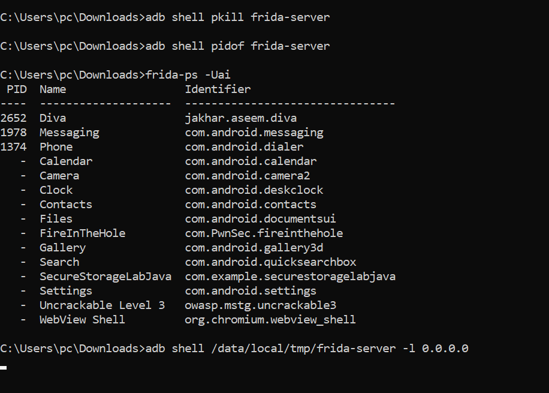

**Exigence 2 :** Fournir le résultat de `frida-ps -Uai` listant au moins 3 applications.

**Preuve — Capture 42 (et Capture 2) :** La sortie de `frida-ps -Uai` liste bien plus de 3 applications :

| PID | Nom | Identifiant |
|---|---|---|
| 2652 | Diva | `jakhar.aseem.diva` |
| 1978 | Messaging | `com.android.messaging` |
| 1374 | Phone | `com.android.dialer` |
| - | Calendar | `com.android.calendar` |
| - | Camera | `com.android.camera2` |
| - | FireInTheHole | `com.PwnSec.fireinthehole` |
| - | SecureStorageLabJava | `com.example.securestoragelabjava` |
| - | Uncrackable Level 3 | `owasp.mstg.uncrackable3` |
| ... | ... | ... |

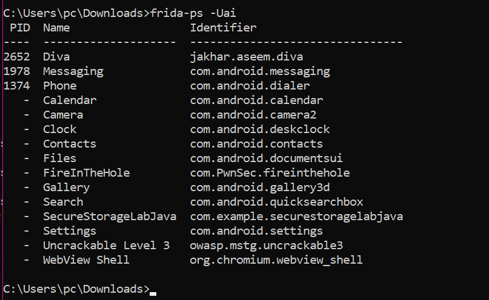

✅ **Livrable satisfait.**

### 11.3. Injection

**Exigence :** Créer `hello.js` et capturer la sortie de `frida -U -f <package> -l hello.js`.

**Preuve — Capture 3 :** La commande `frida -U -f jakhar.aseem.diva -l hello.js` lance avec succès l'application et affiche :

```
Spawned `jakhar.aseem.diva`. Resuming main thread!
[Android Emulator 5554::jakhar.aseem.diva ]-> [+] Frida Java.perform OK
```


✅ **Livrable satisfait.**

### 11.4. Dépannage

**Exigence :** Simuler une erreur (arrêter frida-server), puis documenter comment vous l'avez diagnostiquée et corrigée.

**Preuve — Capture 41 :** La procédure de dépannage est documentée :

#### Étape 1 — Arrêter frida-server (Simuler l'erreur)

```powershell
adb shell pkill frida-server
```

#### Étape 2 — Vérifier l'arrêt (Diagnostiquer)

```powershell
adb shell pidof frida-server
```

Aucune sortie confirme que le serveur a été terminé.

#### Étape 3 — Tenter de lister les processus (Observer l'erreur)

```powershell
frida-ps -Uai
```

À ce stade, `frida-ps` échouerait à se connecter si aucun serveur n'est en cours d'exécution.

#### Étape 4 — Redémarrer frida-server (Corriger)

```powershell
adb shell /data/local/tmp/frida-server -l 0.0.0.0
```

#### Étape 5 — Vérifier la récupération

```powershell
frida-ps -Uai
```

**Preuve — Capture 42 :** Après le redémarrage du serveur, `frida-ps -Uai` retourne à nouveau la liste complète des applications, confirmant la récupération.


> **Note de dépannage supplémentaire issue de la Capture 40 :** La tentative initiale d'utilisation du drapeau `--no-pause` avec `frida -U -f jakhar.aseem.diva -l hello.js --no-pause` a provoqué l'erreur `frida: error: unrecognized arguments: --no-pause`. Ce problème a été résolu en supprimant le drapeau, car la version 16.3.3 de Frida ne supporte pas `--no-pause` (l'application reprend automatiquement après le spawn dans cette version).

✅ **Livrable satisfait.**

---

## 12. Dépannage

### Problèmes courants et résolutions

| Problème | Diagnostic | Solution |
|---|---|---|
| `adb devices` affiche `unauthorized` | Clé RSA non acceptée sur l'appareil | Accepter l'invite d'autorisation de débogage sur l'émulateur/appareil |
| `frida-ps -U` échoue à se connecter | `frida-server` n'est pas en cours d'exécution | Vérifier avec `adb shell pidof frida-server` ; redémarrer avec `adb shell /data/local/tmp/frida-server -l 0.0.0.0` |
| Décalage de version entre client et serveur | Versions différentes de `frida` et `frida-server` | S'assurer que les deux ont la même version (ex. les deux en `16.3.3`) |
| `--no-pause` non reconnu | Drapeau non supporté dans cette version de Frida | Supprimer `--no-pause` ; l'application reprend automatiquement |
| Mauvaise architecture de `frida-server` | ABI CPU incompatible | Revérifier avec `adb shell getprop ro.product.cpu.abi` et télécharger le bon binaire |
| `Permission denied` lors du lancement du serveur | Permissions d'exécution manquantes | Exécuter `adb shell chmod 755 /data/local/tmp/frida-server` |
| `recv appelée` n'apparaît jamais | Aucune activité réseau dans l'application cible | C'est attendu si l'application n'appelle pas `recv` ; déclencher une action réseau dans l'application |

---

## 13. Annexe — Correspondance des captures d'écran

Le tableau ci-dessous associe chaque capture d'écran à l'étape correspondante du TP pour une consultation rapide.

| Capture | Étape du TP | Description |
|:---:|---|---|
| 1 | Étape 3.4 | `adb push frida-server` — transfert réussi |
| 2 | Étape 4.2 | `frida-ps -Uai` — liste des applications |
| 3 | Étape 5.1 | Injection de `hello.js` — `[+] Frida Java.perform OK` |
| 4 | Étape 5.2 | Injection de `hello_native.js` (mode spawn) — `[+] Script chargé` |
| 5 | Étape 5.2 | Injection de `hello_native.js` (mode attach) — `[+] Script chargé` |
| 6 | Étape 6.2 | `Process.arch` → `"x64"` |
| 7 | Étape 6.4 | `Process.getModuleByName("libc.so")` — base, chemin, taille |
| 8 | Étape 6.5 | `getExportByName("recv")` — adresse retournée |
| 9 | Étape 3.7 | `adb shell ps` — processus `frida-server` confirmé |
| 10 | Étape 6.3 | `Process.mainModule` → `app_process64` |
| 11–14 | Étape 6.6 | `Process.enumerateModules()` — bibliothèques chargées |
| 15–17 | Étape 6.7 | `Process.enumerateThreads()` — threads actifs |
| 18–19 | Étape 6.8 | `Process.enumerateRanges('r-x')` — mémoire exécutable |
| 20 | Étape 6.9 | `Java.available` → `true` |
| 21 | Étape 6.10 | Énumération des classes Java (filtrées par nom d'application) |
| 22 | Étape 6.11 / 7.1 | Filtre de modules pour `ssl`/`crypto` |
| 23 | Étape 7.2 | `getExportByName("connect")` — adresse |
| 24 | Étape 7.3 | `hook_connect.js` — hook `connect` chargé |
| 25 | Étape 7.4 | `hook_network.js` — hooks `send`/`recv` chargés |
| 26 | Étape 7.4 | Code source de `hook_network.js` dans l'éditeur |
| 27 | Étape 7.7 | Énumération des classes Java (security/crypto/prefs/sqlite) |
| 28 | Étape 7.5 | Code source de `hook_file.js` dans l'éditeur |
| 29 | Étape 7.5 | Injection de `hook_file.js` — adresses `open`/`read` affichées |
| 30–31 | Étape 7.8 | `Process.enumerateRanges('r-x')` — régions exécutables |
| 32 | Étape 7.9 | `Process.id`, `Process.platform`, `Process.arch` |
| 33 | Étape 8.2 | Code source de `hook_prefs.js` |
| 34 | Étape 8.2 | `hook_prefs.js` — chargé et actif |
| 35 | Étape 8.3 | Code source de `hook_prefs_write.js` |
| 36 | Étape 8.3 | `hook_prefs_write.js` — chargé et actif |
| 37 | Étape 8.4 | Code source de `hook_sqlite.js` |
| 38 | Étape 8.4 | `hook_sqlite.js` — chargé et actif |
| 39 | Étape 8.5 | Énumération des classes Java (debug/root/security/crypto/sqlite/prefs) |
| 40 | Livrables | Vérification des versions + `adb devices` + dépannage |
| 41 | Livrables | Procédure d'arrêt/redémarrage de `frida-server` |
| 42 | Livrables | `frida-ps -Uai` après récupération |

---

> **Fin du rapport de TP**
